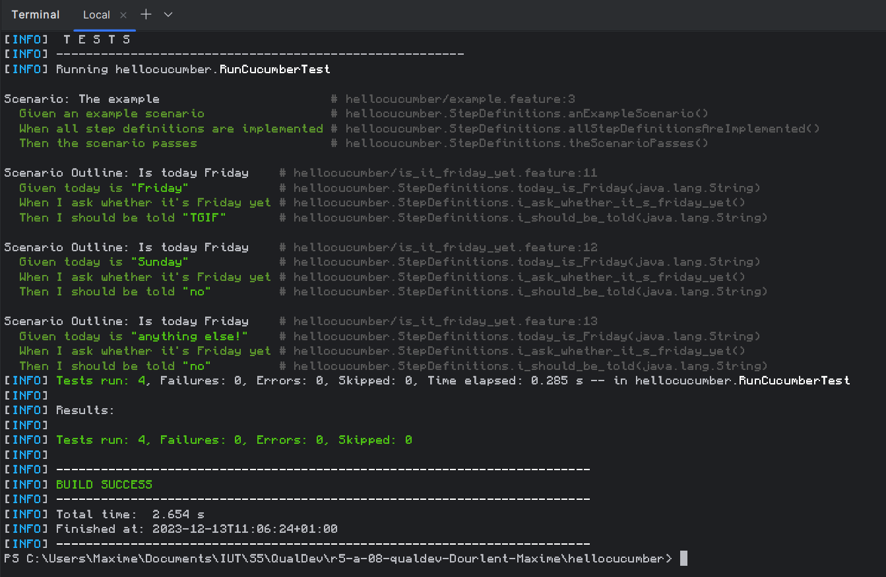
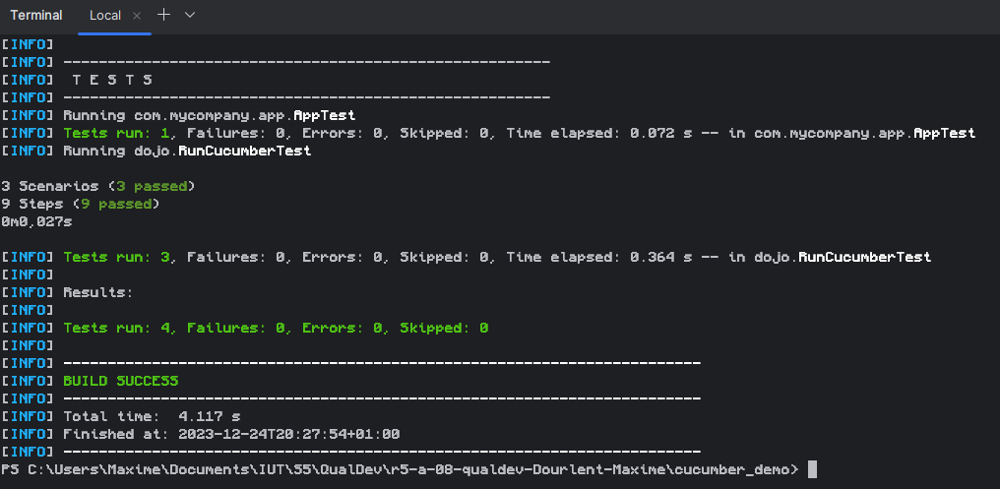

= R5.A.08 -- Dépôt pour les TPs
:icons: font
:MoSCoW: https://fr.wikipedia.org/wiki/M%C3%A9thode_MoSCoW[MoSCoW]

Ce dépôt concerne les rendus de mailto:maxime.dourlent@etu.univ-tlse2.fr[Dourlent Maxime].

== TP1

=== Fichier "is_it_friday_yet.feature"

[source,java]

Feature: Is it Friday yet ?
  It's important to know if it's Friday

  Scenario Outline: Is today Friday
    Given today is "<day>"
    When I ask whether it's Friday yet
    Then I should be told "<answer>"

    Examples:
      | day            | answer |
      | Friday         | TGIF   |
      | Sunday         | no     |
      | anything else! | no     |

---
=== Tests

== TP2

=== Fichier "Order.java"

[source,java]

package app;
import java.util.List;
import java.util.ArrayList;
public class Order {
    private String owner = "";
    private String target = "";
    private List<String> cocktails = new ArrayList<String>();
    public void declareOwner(String owner){
        this.owner = owner;
    }
    public void declareTarget(String target){
        this.target = target;
    }
    public List<String> getCocktails(){
        return cocktails;
    }
}

---
=== Tests

== TP3...
